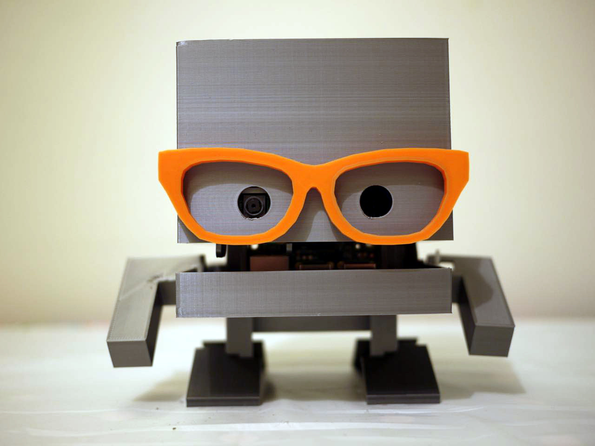

# Bleep the TJBot

This repository is where I'm collecting the various bits and pieces I have put
together to make Bleep the TJBot.

Bleep is a bit different to [normal TJBots](https://ibmtjbot.github.io/). He has two arms and
wears glasses.

## Custom parts

### Right arm

 His right arm doesn't move like his left one; it simple clips onto the jaw piece
 and sits at a nice angle.

  - [right-arm.stl](parts/right-arm.stl)

### Glasses

The glasses have a peg on their bridge that can push into a 6mm hole that you
need to carefully drill into the normal TJBot head piece.

There are also a pair of 'ears' that can be pushed out from the inside of the
head piece (again, through carefully drilled 6mm holes) to give the arms of the
glasses something to hook onto. They are optional - I have found the friction
of the nose peg is enough to hold the glasses in place.

  - [glasses.stl](parts/glasses.stl)
  - [ears.stl](parts/ears.stl)
